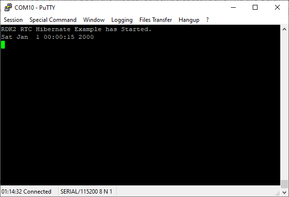
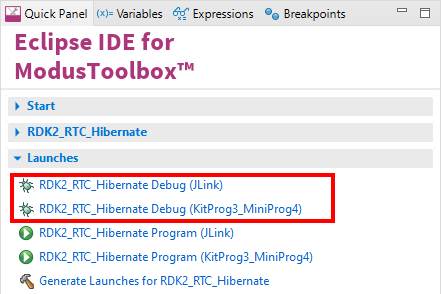

# RDK2 RTC Hibernate Example

Rutronik Development Kit Programmable System-on-Chip CY8C6245AZI-S3D72 "RTC Hibernate" Example. 

This example demonstrates one of the low power modes: hibernation. RTC alarm is used as a wake-up source.

 

## Requirements

- [ModusToolbox® software](https://www.infineon.com/cms/en/design-support/tools/sdk/modustoolbox-software/) v3.0

### Using the code example with a ModusToolbox IDE:

1. Import the project: **File** > **Import...** > **General** > **Existing Projects into Workspace** > **Next**.
2. Select the directory where **"RDK2_RTC_Hibernate"** resides and click  **Finish**.
3. Update libraries using  a **"Library Manager"** tool.
4. Select and build the project **Project ** > **Build Project**.

### Operation

This example is used to check low power consumption while hibernating with RTC peripheral active. The system is online for a certain amount of time (1 second by default) and then is put to hibernate (2 seconds by default) until the RTC alarm wakes the system up. Hibernate setup function that allows to put the system to hibernation with desired amount of time in seconds is implemented in the example:

`cy_rslt_t Hibernate(cyhal_rtc_t *obj, uint32_t seconds)`

Every time the system wakes up from the hibernation it starts executing from the reset vector. No RAM content is saved during the hibernation. The terminal shows the RTC date on every wakeup:

### Debugging

If you successfully have imported the example, the debug configurations are already prepared to use with a the KitProg3, MiniProg4, or J-link. Open the ModusToolbox perspective and find the Quick Panel. Click on the desired debug launch configuration and wait until the programming completes and the debugging starts.

## Legal Disclaimer

The evaluation board including the software is for testing purposes only and, because it has limited functions and limited resilience, is not suitable for permanent use under real conditions. If the evaluation board is nevertheless used under real conditions, this is done at one’s responsibility; any liability of Rutronik is insofar excluded. 

